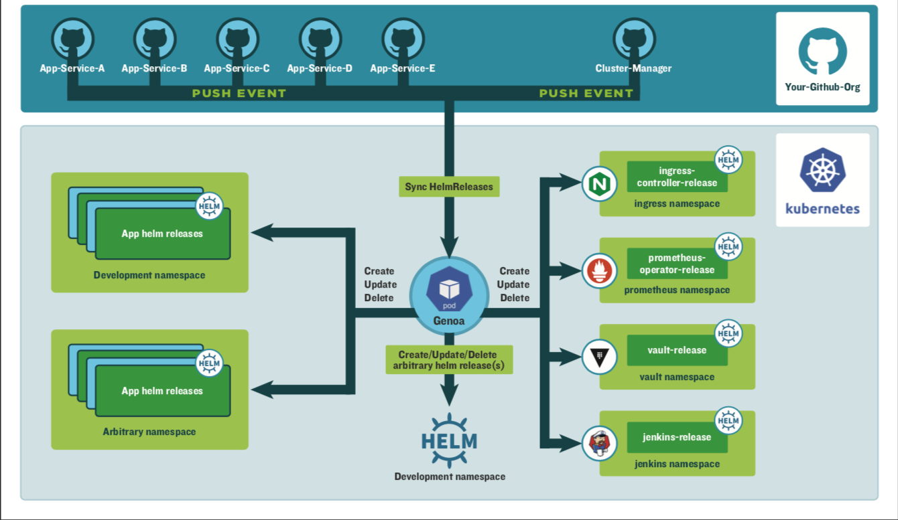

# Genoa
WIP: Opinionated webhook based GitOps controller that installs and manages helm (v3) releases from configured github/gitlab repositories

## Installing the Chart
You can install the chart with the release name `genoa` as below.

```console
$ kubectl create ns genoa
$ helm upgrade genoa charts/genoa --install --namespace=genoa
```


