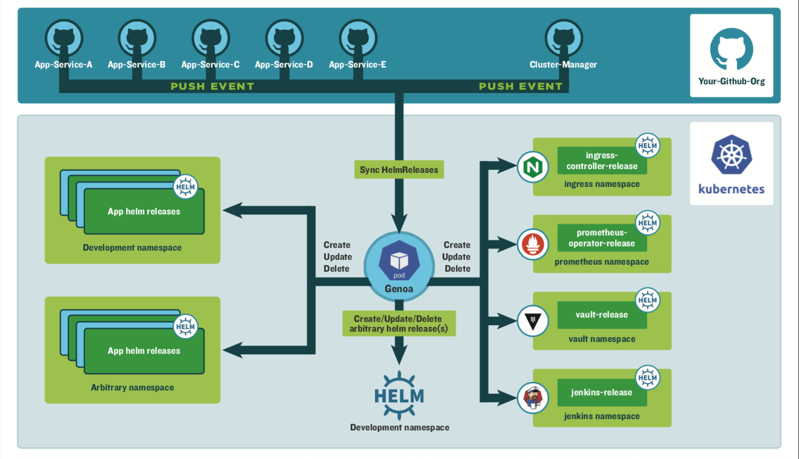

# Genoa
WIP: Opinionated webhook based GitOps controller that installs and manages helm (v3) releases from configured github/gitlab repositories

Genoa does two important things:

* Allows you to manage your helm releases in a GitOps fashion using a custom resource definitions of the chart name, version, and values
* Responds to git webhook invocations when those resource definitions change (gitops)



## Installing the Chart
You can install the chart with the release name `genoa` as below.

From this repository, create your own `genoa.values.yaml` file and install the chart:

```console
$ kubectl create ns genoa
$ helm upgrade genoa charts/genoa --install --namespace=genoa --values=genoa.values.yaml
```
NOTE: For custom helm repositories, you need to tell Genoa about them with the `config.helmRepos` in your Genoa values.yaml file.
The  can be viewed in `repositories.yaml` file in this repository.

## Using Genoa
After installing the Genoa helm chart it creates `releases.coveros.apps.com` as a CRD in the cluster. You use Genoa by creating `release` CRs
that describe the helm releases you want to manage.

See [./sample-releases](./sample-releases) for examples of release CRs. 

See [api/v1alpha1/release_types.go](api/v1alpha1/release_types.go) for a full spec of the values you can put in a release.

Side note: Genoa can adopt existing helm releases by simply building a release.yaml to represent the current chart and values

Annotations that control the release:
```
  annotations:
    "coveros.apps.genoa/autoDeleteNamespace": "true" # DISABLED. delete namespace when release is deleted
    "coveros.apps.genoa/follow-git-branch": "master" # which branch this follows for webhook
    "coveros.apps.genoa/notification-channel-id": "YOUR_SLACK_CHANNEL_ID" # who to notify
```

Important fields for every release:
```
  chart: stable/jenkins # req: what chart
  version: 2.4.1        # req: pin a version
  values: # values files for the helm chart
    master:
      adminUser: admin
      adminPassword: secRet!
    persistence:
      enabled: false
```

TODO:
* How to set up slack notifications with "slack app oauth token"

### Registering the webhook

To enable Gitops behavior, you need to set your Git server with a webhook to invoke the controller when
your helm release CRs change in Git. Your `genoa.values.yaml` file needs to include these things:

```
config:
  github: # example for github
     enabled: true
     accessToken: xxxxxxxxx # user or deploy key as access token to authenticate to github to fetch code
     webhookSecret: abc123xyz # generate this from a ruby -rsecurerandom -e 'puts SecureRandom.hex(20)'
     deployDir: /deploy # the directory where you have your release.yaml files live in the repo
```
Create these, then install the chart and it will tell you what to register in github as part of the notes.

## Use cases for genoa

Need to think through how you could do complicated things.

* Simple case where you have a /deploy directory which notifices single cluster for helm release changes
* Case where you have directories representing individual clusters (or even namespaces)
* Case where you have separate repositories representing clusters or namespaces
* Complicated case where /global-deploy directory notifies multiple clusters that a central helm release has changed and therefore should be deployed to multiple clusters. Could use CR branch tags to test on a branch first in a particular cluster, then use the master branch to roll out to all clusters.


## Contributing

Pre-req:
* golang 1.14.1
* kube builder KubeBuilderVersion:“2.3.1”,


Building:

Set your context to something harmless (docker-for-desktop)

```
make local-build
...
go mod tidy
go: downloading google.golang.org/appengine v1.6.5
...

```


